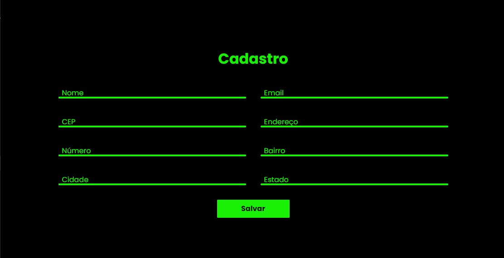

# Consumindo-API-CEP

## Aprendido através do vídeo do professor Fernando Leonid
https://www.youtube.com/watch?v=imk6Y0viabg

- [ ]  Capturar valor do campo CEP
- [ ]  URL API
- [ ]  Pesquisar CEP na API
- [ ]  Imprimir valores nos campos
- [ ]  Tratar erros
- [ ]  Apagar campos
